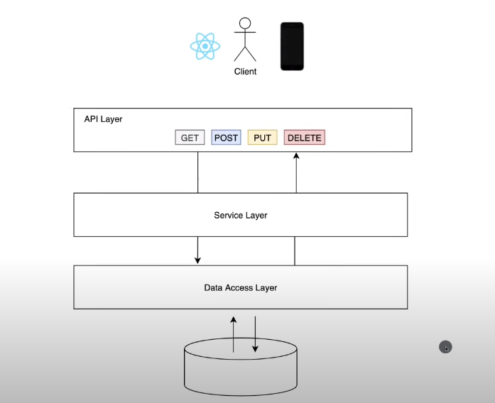

## Steps to run code

1. Run DemoApplication.java
2. Open http://localhost:8080/api/v1/student on your web browser
3. Use PostMan to test API calls
    - To create a student: `POST http://localhost:8080/api/v1/student`
      - with a request body containing the name, email, dob of a student in JSON format
    - To delete a student: `DELETE http://localhost:8080/api/v1/student/{studentId}`
      - where `studentId` is the student you want to delete
    - To update the name and/or email of a student: `PUT http://localhost:8080/api/v1/student/{studentId}?name={newname}&email={newemail}`
      - where `studentId` is the student you want to update
      - where `newname (optional)` and `newemail (optional)` are the new values of that student

## Definitions

- API layer - e.g. when client clicks on a button, which sends an API call to service layer

- Service layer - processes the API call

- Data access layer - performs crud operations on the database through the API call from service layer

- Maven - a build automation tool that helps you consolidate all dependencies in one place
- Gradle - for android projects

- dependencies are the technologies/software you work with in your project

- maven downloads and stores all the dependencies you need in your local repo, so you don't need internet access (apart from the first time you access the dependency)

- API endpoint: the server side that provides the requested resource

## Spring Annotations

- `@Component`
  - Annotates a class. Tells Spring that this class is a bean, and Spring manages all beans. A bean has to be instantiated by Spring, and made available for dependency injection
  - Usually an app uses this `@Component` annotation. If it doesn't it probably uses a combination of `@Service`, `@Repository`, and `@Controller`, which are beans with more specific roles

- `@Service`
  - Annotates a service-layer class. Handles business logic

- `@Repository`
  - Annotates a data-access class. Interacts directly with database

- `@Controller`
  - Annotates an API-layer class. Receives HTTP requests and returns reponses

- `@Autowired`
  - Can be annotated on a constructor, field, or a setter method. Tells Spring to wire up the dependency for you. Spring finds a bean of that data type, and injects it for you. If there are multiple, then have to use more specific annotations

- `@Value`
  - Annotates a string e.g. `@Value("${database.url}")`
  - Spring will look for `database.url` from the property file and inject that value into the string 
  - Promotes loose coupling by injecting values instead of hardcoding 
  - Only works for a class with `@Component` annotation

- `@Bean`
  - Annotates a method. Whatever the method returns, make it a bean

- `@RequestMapping`
  - Annotates a controller class or method
    Maps all HTTP requests to that URL
  - Within that class, can map methods to more specific URLs based on `path`

- `@RestController`
  - A controller class that returns JSON response

- `@SpringBootApplication`
  - Initializes all beans, `@Configuration` files, etc upon launching the application. Is the gateway to running your app

## More definitions

- *Spring Beans*
  - In Spring, the objects that form the backbone of your application and that are managed by the Spring IoC container are called beans. A bean is an object that is instantiated, assembled, and otherwise managed by a Spring IoC container.

  - Inversion of Control (IoC) is a process in which an object defines its dependencies without creating them. This object delegates the job of constructing such dependencies to an IoC container.

- difference between POST and PUT http requests
  - POST is used to create a resource
    - POST updates a resource, adds a subsidiary resource, or causes a change. A POST is not idempotent, in the way that x++ is not idempotent
use this when you need the server to be in control of URL generation of your resources, e.g. asking server to create a user
  - PUT is used to insert, or replace if already exists, a resource
    - PUT implies putting a resource - creating or completely replacing whatever is available at the given URL with a different thing. By definition, a PUT is idempotent. PUT replaces the resource at the known url if it already exists, so sending the same request twice has no effect.
however, idempotent property is assumed. You have to implement this property correctly in the server
use PUT when you know the URL of thing you will create, e.g. updating a specific user

## Steps I did to create this 'application'
1. go to spring initializr.com and download a spring mvc dependencies file
2. go to intellij and open the file

<!-- -->

1. in postgresql, run code `CREATE DATABASE student`
2. then run `GRANT ALL PRIVILEGES ON DATABASE "student" to postgres`
3. when you run `\l`, you can now see student as a database which you can connect to using `\c student`

<!-- -->

1. to connect intellij to postgre database 
   - install DB Browser plugin (already did)
   - go to view -> tool windows -> DB Browser
   - add new connection (+ icon) -> postgresql, then under database field put in the name 'student' (test connection to check)

2. to test if api calls work correctly
   - open postman (website)
   - by calling the correct api url with the appropriate parameters/request body, the data in localhost as well as postgresql database should update accordingly